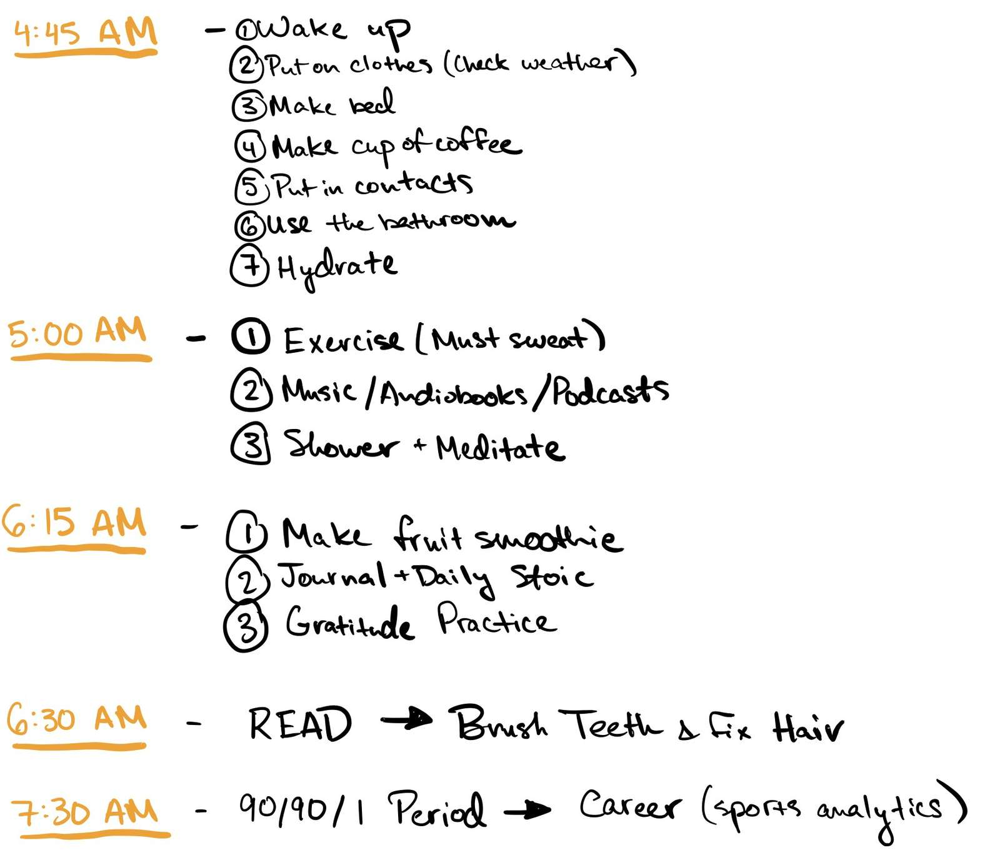

After reading Robin Sharma’s The 5 AM Club, I was motivated to get a headstart on my day. For the past few years, I had been sleeping in as much as I possibly could. As a student, my alarm would go off around 10 minutes before my Zoom class, and I would throw a shirt on, pants (if I had time), and jump into my chair to attend my first class.

I did not enjoy this morning routine. In fact, that is why I picked up Robin Sharma’s book. The book outlines a 20/20/20 approach to structuring the extra time you get from waking up before sunrise. This approach consists of 20 minutes of exercise, 20 minutes of planning, and 20 minutes of studying.

Personally, I moved some things around to better fit my goals and priorities at the time. However, the rigid organization proposed by Sharma in this 20/20/20 method inspired me to create something similar.

---

Last semester, I was able to take my online college classes in New York City with two roommates. Some of my personal goals at the time were to work out more, read more, and journal more. I set out to go to the gym, read for an hour, meditate, and journal every morning within the first two hours of my day. As a student, I struggled to find the time in the day to do these things. Specifically, if I decided to read for an hour in the evening, I could be missing out on quality bonding time with my roommates, time to explore the city, or an impromptu walk through Central Park. I did not want to give up any of these things, so I decided to dedicate a couple of hours in the morning each weekday to fulfilling my goals.

Utilizing [habit stacking](https://jamesclear.com/habit-stacking) from James Clear’s Atomic Habits, I created an effective routine that psychologically tricked me into not breaking my habits. Habit stacking is the act of doing a behavior directly after another behavior to create a cue->routine->reward system. I have found that habits are much easier to form in the morning when I am not fully awake and more prone to external influence. I attached a picture of my morning routine last semester to show an example of habit stacking.

As you can see, I used habit stacking with activities I have wanted to do more (journalling, meditating) with behaviors I had already been doing (showering, making a smoothie) to create a link between the actions. It may seem trivial to write down things like “wake up” or “put on clothes” in my routine, but I found that when I did things in a different order, I would end up craving a bit of extra sleep and/or wanting to scroll through social media. Therefore, laying out every little action helped me keep track of my mind when I was half-awake in the mornings.

The last activity on my morning routine, the “[90/90/1 Period](https://www.forbes.com/sites/learnvest/2014/10/01/need-a-productivity-boost-master-the-90901-rule/?sh=13c53978294f)”, is a strategy outlined in Sharma’s book that allows you to take advantage of the extra time in your morning and develop a skill/passion for one 90 minute period a day for 90 days. This can be shifted to a “45/45/1 Period” for those unable to commit 90 minutes a day. I was able to finish the first draft of a soccer analytics research paper I had been putting off for quite some time with this method. People have used it to pick up a new language, learn how to play an instrument, take online courses, and other hobbies that are hard to find time for during the day.

## Top Tips for Creating a Routine and Sticking to It

- **Know why you are waking up at 5 AM**

There were many times where I wanted to give in and sleep an extra hour or two before getting ready for the day. When this happened, I fell back on my “why.” I enjoy life more by waking up before the sun rises to pursue my soccer analytics passion and learning more about the world. What is your “why”?

- **Accept that you are not perfect**

You are going to mess up. Shit happens. The plus side is new research has found that [going back on a habit a couple of times does not have long-term effects on the habit itself](https://jamesclear.com/new-habit). Do not let small failures break down all of the work you have done.

- **Get enough sleep**

Without sleep, waking up at 5 AM is useless. You will be unable to focus and will possibly cause long-term damage to your health if you consistently get less than 6 hours of sleep per night. On the days where I got poor sleep the night before, I was groggy throughout the day and found it very hard to concentrate on specific tasks that I needed to get done. The [National Sleep Foundation](https://www.sleepfoundation.org/how-sleep-works/how-much-sleep-do-we-really-need) recommends getting between 7–9 hours of sleep per night depending on age. Here are a couple of [tips](https://www.elevatedhealth.md/blog/2020/2/5/12-tips-for-good-sleep) for getting good sleep.

|                                                                                                                                          |
| :----------------------------------------------------------------------------------------------------------------------------------------------------------------------: |
| _Photo by [Burst](https://www.pexels.com/@burst) from [Pexels](https://www.pexels.com/photo/white-bedspread-beside-nightstand-with-white-and-copper-table-lamp-545012/)_ |

There are bound to be failures with any attempt at changing a routine. The final product of my morning routine above took at least ten reworks to polish. There were many days where I would manage my time poorly and be unable to wake up early because I did not get to bed on time. However, once I got into a rhythm, I was able to continue this habit for three months.

I can pretty firmly say starting this morning routine changed my life.

Do I do it now? Kind of. I still have a very similar morning routine, adjusted for dorm life. Continuing to utilize habit stacking first thing in the morning has done me wonders for keeping my life in balance. I have left the 5 A.M. Club and temporarily joined the 7 A.M. Club.

## Top Lessons I Learned

- **Time is our most valuable asset**

By waking up at 5 A.M., I realized how much time I have been wasting my entire life. By dedicating around three hours every day to things I was putting off for more “time-sensitive” tasks, I achieved all of my goals and more.

- **Waking up with the sun is inspiring**

Taking a walk/run through a park in New York City first thing in the morning and watching the sun rise was something I am extremely grateful to have experienced. I never truly appreciated the beauty of watching the sun rise and illuminate the sky until I decided to step out of my comfort zone and wake up a bit earlier. The sunrise reminded me I was one of a few people awake in the city, working towards my passions. This inspired me each morning to keep making good use of my time.

- **It is hard to get distracted when no one is awake**

One of my favorite things about waking up early is fewer distractions. I found that the morning is the best time to reflect on myself, contemplate who I want to be in life, and meditate.

I completely recommend a morning routine for anyone who finds themselves wanting a bit of extra time in the day or has certain hobbies/activities they would like to explore. Waking up at 5 A.M. is not always the right choice for everyone, but if it can fit into your lifestyle, I urge you to give it a try, and it will allow you to appreciate life so much more.